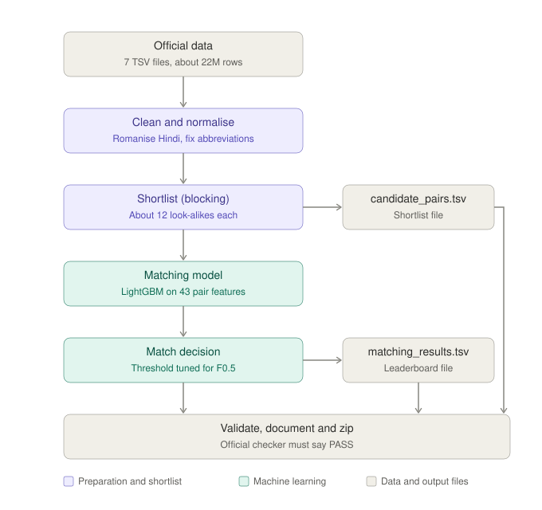
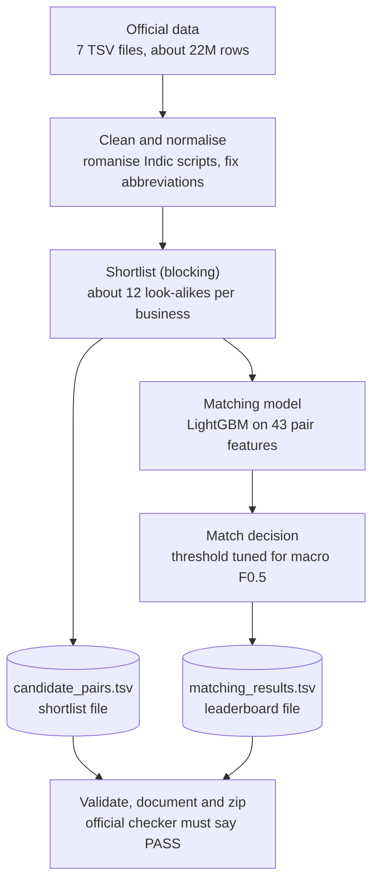
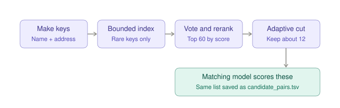
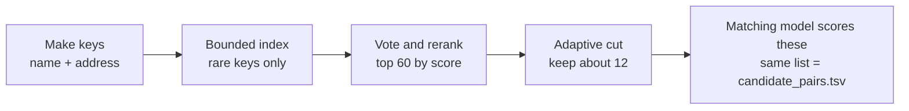
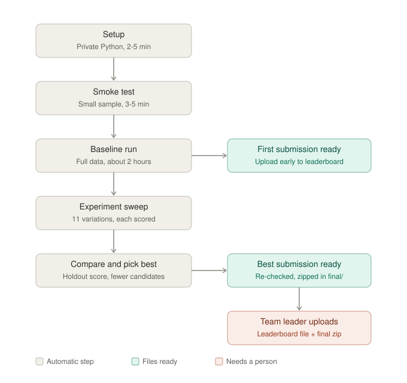
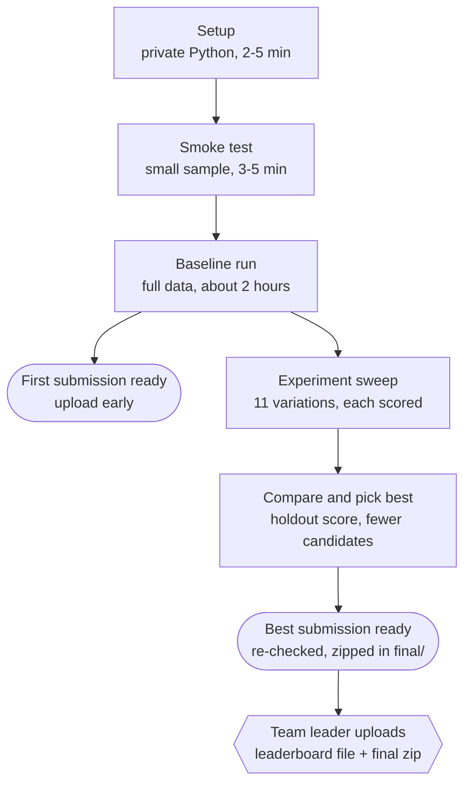
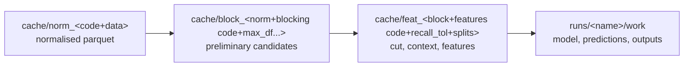
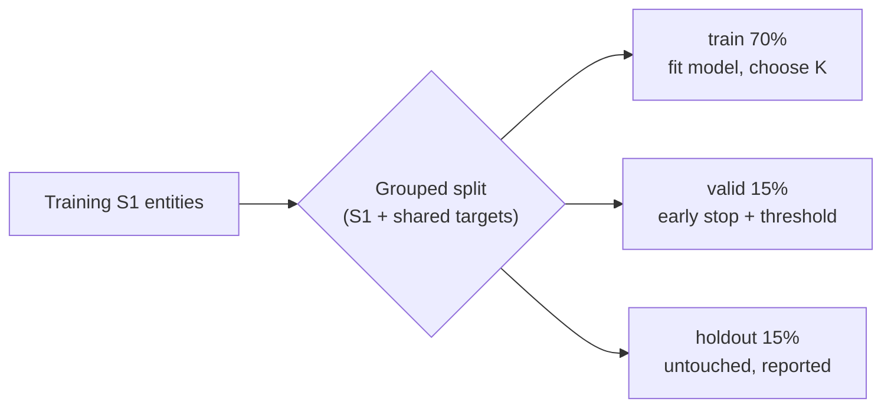

# Architecture: Business Entity Resolution (Amazon ML Challenge 2026)

Plain-language questions and answers are in [QNA.md](QNA.md). How to run everything is in
[../PLAN.md](../PLAN.md) and [../README.md](../README.md).

---

## 1. The whole system





| Stage | Code | Input, then output | Key idea |
|---|---|---|---|
| Prepare | `src/er/pipeline.py: prepare()` + `src/er/text.py` | 7 raw TSVs, then normalised parquet parts (500k rows each) | Offline romanisation of 9 Indic scripts; consonant "skeleton"; legal-form and abbreviation maps; country kept as an open-set label |
| Block | `src/er/blocking.py` + `pipeline.block()` | Normalised tables, then up to 60 preliminary candidates per S1 | Bounded inverted index of hashed, country-prefixed keys; keys held by more than 300 targets are dropped; IDF voting; quick string rerank |
| Cut | `pipeline._cut()`, `blocking.choose_cut()` | Preliminary candidates, then the final K candidates per S1 | K chosen on the train split as the smallest budget losing ≤ 1% link recall (hard cap 40) |
| Context | `blocking.add_context()` | Final candidates, then competition features | For each target: how many S1 want it, and this pair's rank among them. Computed over the whole split |
| Features | `src/er/features.py`, `pipeline.featurize()` | Pairs, then 43 float features | RapidFuzz similarities, Jaccard of tokens and skeletons, number, house and postcode agreement, missing-field flags |
| Train | `pipeline.train()` | Train and valid splits, then a LightGBM model and threshold | Grouped split, early stopping on valid, threshold tuned on valid, score reported on an untouched holdout |
| Predict | `pipeline.predict()` | Test features, then both TSVs | Refuses to write output unless the scored pairs equal the candidate set exactly |
| Validate | `check_outputs()`, `official_validator()` | Outputs + raw test TSVs, then PASS or FAIL | Own vectorised check plus Amazon's `utils/validate_submission.py` |
| Report | `src/er/report.py` | Run artefacts, then results table, filled template, zip | Picks the best run, re-validates it on the real data, builds `<team>_submission.zip` |

---

## 2. Inside the shortlist (blocking)





**Key families.** Every key is hashed and prefixed with the record's country.

| Key | Example ("Ram Marketing Pvt Ltd, 12 MG Road, Kolkata") | Why |
|---|---|---|
| `t` name token | `ram`, `marketing` | Basic word match |
| `k` skeleton token | `rm`, `mrktng` | Matches Hindi-script names and vowel typos |
| `c` / `e` compact prefix / suffix | `rammar…` / `…keting` | Matches glued names such as `wilfordhancock.com`, and junk prefixes |
| `h` / `hs` house number + street | `12 mg` | Very selective address anchor |
| `a` address skeleton token | `klkt` (Kolkata) | Street and city words |
| `p` postcode | `700001` | When present |
| `n2` name-token pair | `marketing ram` | Rare even when each word is common |
| `na` / `nh` / `np` name + address / number / postcode | `ram klkt`, `ram 12` | Rescues businesses whose single keys are all common |

**Settings** (all measured and tunable; see `configs/sweep.json`):

| Setting | Value |
|---|---|
| `max_df` | 300 |
| `key_budget` | 1200 postings |
| `prelim` | 60 |
| `recall_tol` | 0.01 |
| `max_k` | 40 |

The quick rerank score is:

`q = 0.6 × max(token_set(name), ratio(skeleton)) + 0.4 × token_set(address)`

If either address is empty, the address term is set to 50.

---

## 3. What happens on the Mac (`bash run.sh`)





---

## 4. Caches and resumability

Every stage writes to a cache folder whose name is a fingerprint of the settings **and** the
source code that produced it. The fingerprints are chained, so a change anywhere invalidates
everything downstream automatically.



- **Model-only experiments** (lr, leaves, drop_features, refit) reuse `norm`, `block` and `feat`,
  and take minutes.
- **Blocking experiments** (max_df, key_budget, prelim) rebuild `block` and `feat`.
- **Interrupted runs resume.** Blocking parts are named by S1 range; data prep resumes per source
  file; extraction is atomic.
- **One job at a time.** `run.sh` holds `.run.lock`.

---

## 5. Validation design (why the local score is honest)



- **Primary number:** `holdout_macro_f05_untouched`, computed with the official per-entity
  F0.5 (singletons included, "both empty" scores 1).
- **Country limits:** the training data covers the US and India only, so France performance
  cannot be measured locally.

---

## 6. Repository layout

```text
AmazonML_Project/
├── run.sh / RUN_ME.command   one-command setup + run (macOS/Linux)
├── START_HERE.txt            shortest plain-language Mac instructions
├── team_config.json          team name and member names used during finalization
├── src/run_pipeline.py       CLI: smoke | run | sweep | compare | finalize | prune | auto
├── src/make_sample.py        builds the smoke-test sample from the real data
├── src/er/text.py            normalisation, Indic romanisation, skeletons
├── src/er/blocking.py        keys, bounded index, rerank, cut, context
├── src/er/features.py        pair features, macro F0.5, one-to-one rule
├── src/er/pipeline.py        resumable stages, splits, LightGBM, validation
├── src/er/report.py          results table, documentation fill-in, zip
├── src/er/common.py          config, IO, official SHA-256 values, logging
├── tests/test_er.py          unit tests (fabricated records)
├── configs/sweep.json        experiment plan
├── docs/                     this file, QNA.md, diagrams
├── AGENT_BRIEF.md            brief for an autonomous AI agent
├── PLAN.md                   plain-language plan for teammates
├── README.md                 technical run and reproduction guide
├── requirements.txt          pinned Python dependencies
└── (not in git) data/ cache/ runs/ final/ logs/ experiments/ .venv/ .tools/
```
